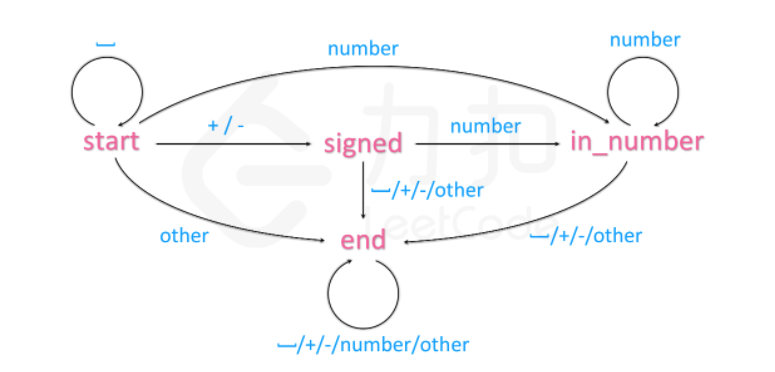

请你来实现一个 `atoi` 函数，使其能将字符串转换成整数。 

 

<!-- more -->

首先，该函数会根据需要丢弃无用的开头空格字符，直到寻找到第一个非空格的字符为止。接下来的转化规则如下：

- 如果第一个非空字符为正或者负号时，则将该符号与之后面尽可能多的连续数字字符组合起来，形成一个有符号整数。

- 假如第一个非空字符是数字，则直接将其与之后连续的数字字符组合起来，形成一个整数。

- 该字符串在有效的整数部分之后也可能会存在多余的字符，那么这些字符可以被忽略，它们对函数不应该造成影响。

  注意：假如该字符串中的第一个非空格字符不是一个有效整数字符、字符串为空或字符串仅包含空白字符时，则你的函数不需要进行转换，即无法进行有效转换。

在任何情况下，若函数不能进行有效的转换时，请返回 0 。

**提示：**

本题中的空白字符只包括空格字符 ' ' 。
假设我们的环境只能存储 32 位大小的有符号整数，那么其数值范围为 [−2^31,  2^31 − 1]。如果数值超过这个范围，请返回  INT_MAX (2^31 − 1) 或 INT_MIN (−2^31) 。


**示例 1:**

输入: "42"
输出: 42

**示例 2:**

输入: "   -42"
输出: -42
解释: 第一个非空白字符为 '-', 它是一个负号。
     我们尽可能将负号与后面所有连续出现的数字组合起来，最后得到 -42 。

**示例 3:**

输入: "4193 with words"
输出: 4193
解释: 转换截止于数字 '3' ，因为它的下一个字符不为数字。

**示例 4：**

输入: "words and 987"
输出: 0
解释: 第一个非空字符是 'w', 但它不是数字或正、负号。
     因此无法执行有效的转换。

**示例 5:**

输入: "-91283472332"
输出: -2147483648
解释: 数字 "-91283472332" 超过 32 位有符号整数范围。 
     因此返回 INT_MIN (−2^31) 。


**解法一：**

首先定位第一个非空格的字符下标i，然后判断其是为+，-或者数字，并记录正负的标志，然后从第一个为数字字符的下标开始，对最后结果sum进行累加，累加后判断是否溢出。

**代码：**

```cpp
class Solution {
public:
    int myAtoi(string str) {
        int len=str.size();
        int i=0;
        while(i<len&&str[i]==' '){//定位第一个非空格的字符
            i++;
        }
        
        if(i==len||str[i]!='-'&&str[i]!='+'&&(str[i]<'0'||str[i]>'9')){//第一个字符只能为-、+或数字
            return 0;
        }
        int flag=1;//标识正负
        long sum=0;  //注意用long避免溢出
        if(str[i]=='-'){
            flag=-1;
            i++;
        }else if(str[i]=='+'){
            i++;
        }
        while(i<len){
            if(str[i]>='0'&&str[i]<='9'){
                sum=sum*10+(str[i]-'0')*flag;
                if(sum>=INT_MAX){
                    return INT_MAX;
                }else if(sum<=INT_MIN){
                    return INT_MIN;
                }
            }else{
                return sum;
            }
            i++;

        }
        return sum;

    }
};
```


**解法二：**

用**自动机**的思想，直接上官方题解：

字符串处理的题目往往涉及复杂的流程以及条件情况，如果直接上手写程序，一不小心就会写出极其臃肿的代码。

因此，为了有条理地分析每个输入字符的处理方法，我们可以使用自动机这个概念：

我们的程序在每个时刻有一个状态 s，每次从序列中输入一个字符 c，并根据字符 c 转移到下一个状态 s'。这样，我们只需要建立一个覆盖所有情况的从 s 与 c 映射到 s' 的表格即可解决题目中的问题。

本题可以建立如下图所示的自动机： 



个人觉得状态机的思想就是对各种情况的转移进行分类总结，跟解法一的本质是一样的。

代码：

```cpp
class Automaton {
    string state = "start";
    unordered_map<string, vector<string>> table = {
        {"start", {"start", "signed", "in_number", "end"}},
        {"signed", {"end", "end", "in_number", "end"}},
        {"in_number", {"end", "end", "in_number", "end"}},
        {"end", {"end", "end", "end", "end"}}
    };

    int get_col(char c) {
        if (isspace(c)) return 0;
        if (c == '+' or c == '-') return 1;
        if (isdigit(c)) return 2;
        return 3;
    }
public:
    int sign = 1;
    long long ans = 0;

    void get(char c) {
        state = table[state][get_col(c)];
        if (state == "in_number") {
            ans = ans * 10 + c - '0';
            ans = sign == 1 ? min(ans, (long long)INT_MAX) : min(ans, -(long long)INT_MIN);
        }
        else if (state == "signed")
            sign = c == '+' ? 1 : -1;
    }
};

class Solution {
public:
    int myAtoi(string str) {
        Automaton automaton;
        for (char c : str)
            automaton.get(c);
        return automaton.sign * automaton.ans;
    }
};

作者：LeetCode-Solution
链接：https://leetcode-cn.com/problems/string-to-integer-atoi/solution/zi-fu-chuan-zhuan-huan-zheng-shu-atoi-by-leetcode-/
来源：力扣（LeetCode）
著作权归作者所有。商业转载请联系作者获得授权，非商业转载请注明出处。
```


**解法三：**

正则表达式，不过好像不属于算法和数据结构的考察范围了，也在这里放上。

```java
import java.util.regex.Matcher;
import java.util.regex.Pattern;
import java.math.BigInteger;
class Solution {
    public int myAtoi(String str) {
        String pattern = "^\\s*([+-]?\\d+)";
        Pattern r = Pattern.compile(pattern);

        Matcher m = r.matcher(str);
        if (!m.find( ))  return 0;
        
        BigInteger ans = new BigInteger(m.group(1));
        if(ans.compareTo(new BigInteger(String.valueOf(Integer.MIN_VALUE)))<0){
            return Integer.MIN_VALUE;
        }
        if(ans.compareTo(new BigInteger(String.valueOf(Integer.MAX_VALUE)))>0){
            return Integer.MAX_VALUE;
        }
        return ans.intValue();
        
    }
}

作者：yun-yu-chen
链接：https://leetcode-cn.com/problems/string-to-integer-atoi/solution/san-chong-fang-fa-zheng-chang-bian-li-you-xian-zhu/
来源：力扣（LeetCode）
著作权归作者所有。商业转载请联系作者获得授权，非商业转载请注明出处。
```


