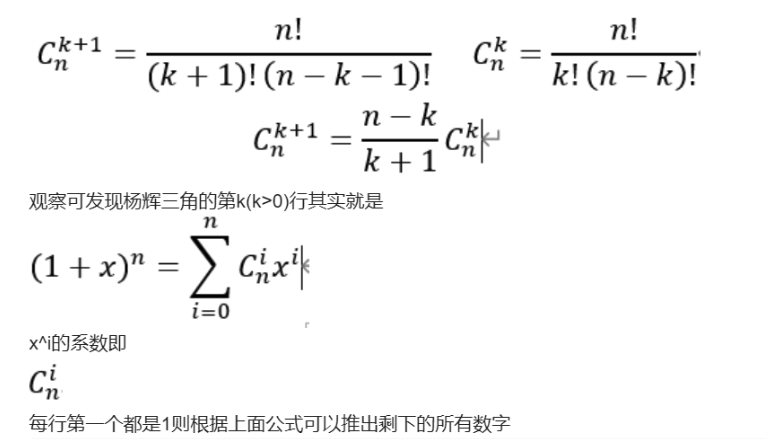

 给定一个非负索引 *k*，其中 *k* ≤ 33，返回杨辉三角的第 *k* 行。 

<!-- more -->

在杨辉三角中，每个数是它左上方和右上方的数的和。

**示例:**

```
输入: 3
输出: [1,3,3,1]
```

**进阶：**

你可以优化你的算法到 *O*(*k*) 空间复杂度吗？


**解法一：**

利用申请一个第k行的空间大小（k+1），然后第k行的第i个数num\[k][i]=num\[k-1][i-1]+num\[k-1][i]，所以我们求num\[k][i]的时候应该倒序填充，这样才能保证在求num\[k][i]的时候num\[k-1][i-1]与num\[k-1][i]仍是上一行的值。


**代码：**

```cpp
class Solution {
public:
    vector<int> getRow(int rowIndex) {
        vector<int>ans(rowIndex+1,1);
        for(int i=0;i<=rowIndex;i++){
            for(int j=i;j>=0;j--){
                if(j==0||j==i){
                    ans[j]=1;
                }else{
                    ans[j]=ans[j]+ans[j-1];
                }
            }
        }
        return ans;
    }
};
```


**解法二：**

见评论区，利用数学关系。



**代码:**

```c
int* getRow(int rowIndex, int* returnSize) {
    *returnSize = rowIndex + 1;
    int* res = calloc(rowIndex + 1, sizeof(int));
    res[0] = 1;
    int i;
    for(i = 1; i <= rowIndex; ++i) 
        res[i] = (long long)res[i - 1] * (rowIndex - i + 1) / i;
    return res;
}

作者：laughing-euclid
链接：https://leetcode-cn.com/problems/pascals-triangle-ii/solution/chun-c-0ms-er-xiang-shi-jie-ti-jian-dan-yi-dong-by/
来源：力扣（LeetCode）
著作权归作者所有。商业转载请联系作者获得授权，非商业转载请注明出处。
```

